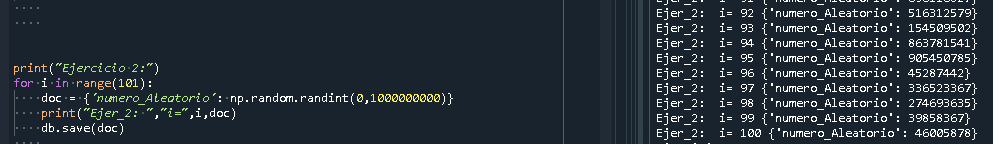

### Bienvenido al ejercicio donde veremos como hacer:
1. Dada la lista:
["Rosita","Hugo","Paco", "Luis"]
Insertar estos elementos en un Json cada uno utilizando un for en CouchDB
2. Insertar 100 json de números randómicos a CouchDB
3. Dada una lista de 10 nombres y otra lista de 10 apellidos, generar combinaciones al azar de las mismas e insertar 100 personas. Cada JSON debe tener, nombre, apellido y cédula(10 dígitos al azar)

```ruby
var1="Comenzemos"
var2="!"
print var1,var2
```

```python
print("1. Primero creamos una bd con el la funcion create de CouchDB y luego procedemos con la lista y el for respectivo para llevar a cabo el ejercicio)
```


```html
<h5>2. En el siguiente utilizamos la biblioteca numpy para generar valores entre de la funcion entre (0 hasta 1000000000) para mandarlo por el for con iteraciones de 100</h5>
```


```c++
#include <iostream>
int main () 
{
    std::cout << "3. Añadimos una biblioteca(choice) para generar la aletoriedad de las listas y usamos una concatenación de numeros random con ""str"" para generar un valor de 10 digitos.";
    return 0;
}
```


```javascript
<HTML>
    <HEAD>
        <TITLE>EJE1.HTML</TITLE>
    </HEAD>
    <BODY>
        <SCRIPT LANGUAGE="JavaScript">
            alert("Por ultimo, verificamos en la base de datos.");
        </SCRIPT>
    </BODY>
</HTML>
```


```php

<?php

echo "Existe algo curioso, que cuando invertimos el print de la salida por consola, se ve como el documento json se ha modificado, añadiendo el id y rev";

?>
```
:racehorse:
